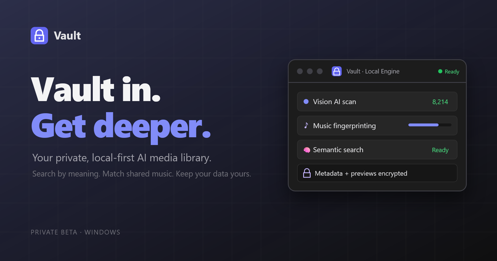

# Vault - Get deeper data.

### You don't remember the filename. You remember what was in it.

Even a well-named file stops at a title — maybe a studio, maybe who's in it. It tells
you nothing about the acts, the setting, or the scene you're actually trying to find
again. So finding anything in a big library comes down to guesswork and scrubbing.

Vault runs a small vision model on your own machine that *watches* every file and
writes down what's really in it — the action, who's on screen, the setting, the mood,
even on-screen text and logos — so you can search the way you actually remember.

Then it goes further: find every clip sharing a song and play them in sync, auto-cut
PMVs from your own library, and earn quests and achievements for curating it.

100% local. No account, no cloud, no telemetry.

[**⬇ Download for Windows**](../../releases/latest) · [Setup guide](SETUP.md) · [Full Feature List](https://aericocode.github.io/Vault/)

Made with 🌿 by [aericode](https://ko-fi.com/aericode)



## Quick start

1. Download `Vault-v*-win-x64.zip` from [Releases](../../releases/latest).
2. Unzip it anywhere — it's portable, there is no installer.
3. Run `Vault.exe`.

The exe is unsigned, so Windows SmartScreen will warn you the first time:
**More info → Run anyway**.

The unzipped folder also contains `SETUP.md` (the full guide) and `LICENSE`.

All app data — database, thumbnails, models, trash — is created next to the exe, so
the whole folder can be moved, copied, or backed up wholesale.

## What you need

**Nothing.** Browsing, playing, tagging and organizing your library work out of the box.

Each of the following features adds one optional dependency:

| Feature | Needs |
|---|---|
| AI scanning / semantic search | a local vision model via [LM Studio](https://lmstudio.ai/download#lm-studio-download-heading), Ollama or vLLM — [step-by-step guide](SETUP.md#2-ai-backend--lm-studio-or-ollama) |
| Thumbnails, hover-scrub, beat bar | ffmpeg — **one click**: Vault offers to download it on first launch |
| Subtitles / transcription | Python + faster-whisper |
| Music ID | fpcalc — same one-click banner |

See [SETUP.md](SETUP.md) for the full walkthrough and model recommendations by VRAM.

## Features

| | |
|---|---|
| **Understands your files** | A local vision model watches every video, image, GIF, audio file and document and writes structured metadata: scene, action, camera angle, lighting, expression, on-screen text |
| **Search that works** | Boolean, regex, fuzzy, metadata-only, and 🧠 semantic search — "crimson" finds red images |
| **Music ID** | Local audio fingerprints find every file sharing a song, then play them stacked in sync |
| **PMV Studio** | Pick a soundtrack and sources — Vault cuts a beat-synced music video for you and renders it to MP4 |
| **Stack & mix** | Stack up to 4 videos in sync or grid up to 8, with a mixer (opacity, masks, blends, presets) and MP4 export |
| **Games & quests** | Play your own library, earn points, streaks, levels, themes and achievements — all opt-in |
| **Encryption** | Password-locked database with auto-lock on idle |
| **Trash with undo** | Real file moves, never silent deletes — one-click Undo and per-file Restore |
| **Dedupe** | Filename+size matching at scan time plus perceptual hashing for visual duplicates |

<details>
<summary><b>🧠 AI scanning &amp; tagging</b></summary>

- **Extended metadata schema** — positioning, action, camera angle, lighting, expression, etc,. Includes OCR style text transcription like logos, site names, studios, actress name, etc.
- **All media types** — video, image, GIF, audio, documents 
- **Audio transcription** — Extracts ~10mins of audio to give the AI more context of the scene
- **Robust resume** — automatic skip of already-processed files 
- **Semantic search**  — build meaning-based search
- **Perceptual dedupe** (`phash`) — catches visual duplicates that filename/size matching misses (re-encodes, resizes, recompressions)
- **Parallel, multi-GPU scanning** — auto-balances across multiple OpenAI-compatible endpoints (LM Studio, **Ollama**, vLLM — see [SETUP.md](SETUP.md))

</details>

<details>
<summary><b>🖥️ Local web viewer</b></summary>

Start with `start.bat` to launch a full browser UI, works in any browser, media streams over HTTP with seeking.

- **Instant library visibility** — new files appear in the viewer (⏳ "not scanned" badge) the moment a scan starts. Click "Scan now" backfills any file on demand from the sidebar
- **Powerful Search** — boolean (AND/OR/NOT), regex, fuzzy matching, metadata-only mode, and 🧠 semantic ("crimson" finds red images)
- **Saved searches** — one-click chips for your fave filter combinations. Drag to reorder, hover to assign a custom color.
- **Collections & folders** — group media into playlists, then nest collections inside folders (any depth); a folder plays as one deduped playlist, with breadcrumb navigation and a tree picker for filing items fast
- **Rich filtering** — media type, content type, language, rating, theme, quality, explicit, starred/❤ fave, has-notes, duplicate, flagged, trashed, unplayable
- **Duplicate detection** — filename+size matching at scan time (shares AI analysis, skips re-scanning) plus perceptual-hash matching for visual dupes; confirmed dupes share notes across copies
- **Trash with undo** — real file moves (never silent deletes), one-click Undo, per-file Restore, original paths preserved
- **Remove records without deleting files** — drop a bad/duplicate entry from the library while leaving the file untouched on disk (re-scan the folder to bring it back)
- **Hand-edit AI metadata** — correct description, themes, tags, language, content type, or quality flag directly from the sidebar when the AI got it wrong
- **Rescan from the UI** — re-run AI analysis on a single file (fixes failed/bad scans) without a full CLI rescan
- **Note snippets** — reusable quick-notes ("Watch again", timestamps) with one-click, and clickable `MM:SS` timestamps that seek the player
- **Resume playback** — remembers your position per file; view counts track real engagement (requires ≥75% watched for video/audio)
- **Mini-player** — pop out and keep browsing while something plays
- **VLC-style playback UX** — controls and cursor auto-hide while playing, region-aware (won't hide over the sidebar or interrupt while paused), fullscreen support
- **Watch activity on hover** — hover the seek bar to show view activity per video. Bonus activity for finishers.
- **Finishers 💦** — click 'Done 💦' to mark what you last saw and sort by Finishers later. Watch activity glows blue to mark the moment.
- **Hot 🔥** — click 'Hot 🔥' to mark exciting and intense moments. Watch activity glows orange to mark the best moments that nearly finished you off.
- **AB Looping Support** — Loop a section of a video with 2 clicks of the AB Loop button in the bottom left of playback controls, or with '[' and ']'.

</details>

<details>
<summary><b>🥁 Beat bar (optional, per-video)</b></summary>

A live beat-detection overlay for videos — analyzes the audio track client-side and renders a scrolling beat visualizer synced to playback.

- Adjustable sensitivity (10 levels), playback speed, and playhead position, all with live preview
- Five icon shapes (circle, heart, star, diamond, square) with configurable fill/border color, size, and opacity
- Stackable visual effects (pulse, ripple, sparks — combine any number, with randomized spark variation)
- Draggable positioning that's remembered per-video and preserved across fullscreen toggles
- Fully local — no data leaves the machine, no cloud audio analysis

</details>

<details>
<summary><b>🎵 Music ID + Editor (opt-in per file)</b></summary>

Find every file containing a song, then play them **stacked in sync**. Powered by [Chromaprint](https://acoustid.org/chromaprint) fully local audio fingerprints.

- **Fingerprint on demand** — select files in the Library → `🎵 Fingerprint (N)`, or use the button in the player sidebar. One-time per file (~5–15s per 5 min); chunks are silence-gated so dead air never causes false matches
- **Automatic matching** — right after fingerprinting, the file is scanned against every known song AND every other fingerprinted file. Files sharing an unknown track get grouped under an `❓ Unknown Song` placeholder — manually rename it once and every linked file updates
- **Teach it songs** — tag a segment by hand (artist + title + start/end with ⏱ position grab) and it becomes a reference fingerprint that hunts the song across the whole library
  - Or use the 'Section' view to label already identified song sections for unknown tracks.
- **MP3s become named references automatically** — scan a music folder (wizard: Audio only → "fingerprint audio") and a strict `Artist - Title.mp3` filename format to auto-create labeled songs + whole-file reference fingerprints, running alongside the AI scan. Every video containing those tracks then labels itself on fingerprint — zero manual tagging
- **Seed packs — song fingerprints without the audio** — export your references as a portable `vault-songseed.json` (📦 Seed packs in the Editor, or `music export-seedpack`), and import packs from anywhere: songs + fingerprints land in the DB (no MP3s needed on disk) and every fingerprinted file is rescanned against just the new references. Strictly pull — you download and pick the file yourself, nothing auto-fetches. Re-importing is idempotent, so updated packs only add what's new
- **≈ Audio similarity** — "Similar audio" (tile hover or player sidebar) ranks the library by songs shared with a file, rarity-weighted, with `≈NN%` badges on the results — a sorting metric no filename search can fake
- **Search by song** — song cards in the Editor tab (search artist/title; each card is a 2×2 mosaic of its videos) plus a `🎵 Song` filter in the Library filter panel
- **Editor tab (Library | Collections | *Editor* | Games)** — songs are reference points: open a card to pick among the VIDEOS sharing that song (hover a video for full details incl. its path). Stack up to **4** layered in sync, or Grid up to **8** side by side in a wall view. Audio tracks auto-align on the shared song using the matcher's offsets; sync nudge buttons persist corrections. Use the visual waveforms to visualize alignment and drag files to align(best when paused).
- **🎚 Mixer sidebar** — per-track opacity, volume, audio master, spotlight, mask effects (gradients, radial, wipe, blend modes), balanced-blend, presets and export in a toggleable sidebar (M key) that keeps the video centered. The mix uses the main player's control bar: seek bar, ⏪◀▶▶⏩, **A-B looping**, speed (applied to every track), volume — with 🎚 Mixer in the Info slot
- **🎛 Custom mixes in the Library** — save a mix (title + description) as a playable Library tile: no ffmpeg export needed, it replays through the Editor with layout/effects/volumes restored. Never AI-scanned; ratings, notes and faves work like any file; title/description editable on reopen
- **Song picker with seed catalog** — the tag form and edit modal suggest from your songs (🔗 = fingerprinted, auto-matchable) plus an offline artist/title seed catalog (📇, auto-imported from seed.json) — names for ~90% of tracks even before you have their audio
- **Beat bar rides the mix** — the 🥁 overlay attaches to the master track on the top layer, same settings as the main player
- **Saved mixes & export** — save/load mix presets, and export the current stack to an MP4 (ffmpeg renders the same opacities/effects/volumes server-side, background queue with progress)
- CLI: `node vault.js music check-tools | fingerprint <id|all> | scan <id|all> | status`

</details>

<details>
<summary><b>🎬 PMV Studio (automatic beat-cut music videos)</b></summary>

Pick a soundtrack and a set of source videos; Vault analyses the track's beats and
energy, maps them onto segments of your sources to build an Edit Decision List, and
renders the result to MP4 with ffmpeg. Entirely local.

- **Beat-aligned cutting** — cuts land on the soundtrack's beats, with segment choice weighted by the track's energy at that moment
- **Ordering modes** — `shuffle` (weighted-random among the strongest candidate segments) or `sequential` to keep source order
- **Transitions** — configurable transition type and duration between segments
- **GPU-accelerated render** — the encoder is detected automatically and falls back to CPU when no supported GPU is present
- **Queued with live progress** — one pipeline runs at a time (like the Music ID exporter); progress is polled from the job row, and stale jobs are recovered on restart
- **Cached analysis** — re-running against the same soundtrack or sources skips straight to the EDL and render step

</details>

<details>
<summary><b>🎮 Games (play your library)</b></summary>

A **Games** tab that turns library videos into games — pick videos in-tab (never a file dialog), with progress saved per game so you can leave, watch something, and come back.

- **Reel Order** — a video is split into randomized clips; drag them onto a timeline in the correct order and timestamp. Scored on ordering + placement accuracy − time; per-difficulty high scores. Clips stream from the library (`/media/:id`), so no file uploads
- **In-tab video picker** — the Games home is a searchable, video-only grid; inside a game a "🔀 Change video" button opens an overlay picker so you never leave the tab. A "🎮 Play in Reel Order" action also appears in the Library player sidebar
- **Saved progress per game** — each game keeps one save slot (server `game_saves` table + a localStorage mirror for instant restore) holding the video, clip layout, placements and elapsed time; leaving the tab pauses the clock and playback, returning resumes exactly where you left off. Saves are auto-removed when their video's record is deleted
- **Extensible host** — games mount behind a uniform interface (`mount/pause/resume/getState/destroy`); more games (a live-media jigsaw, timestamp/blur/rhythm games) slot in without touching the host

</details>

<details>
<summary><b>🏆 Obsession Score (local gamification)</b></summary>

**Fully offline.** No AI model, no setup — it works from the first launch. Don't
want to see it? **Settings → Hide 🏆 Obsession Score** drops the chip and its
toasts while scoring continues underneath, so unhiding shows your real history
rather than a gap. To stop it entirely, run with `--no-gamify`.

- **Points & streaks** — earn score for real engagement (rarity- and duration-weighted so a 2-second thumbnail flip earns far less than actually watching something), with daily streak tracking and decay for inactivity
- **Quests** — dynamic objectives generated from your own library and habits (e.g. "watch 3 unrated horror videos")
- **Levels & unlockable UI themes** — 11 levels from Casual Browser to Send Help, unlocking 6 cosmetic color themes for the viewer as you level up
- **Achievements** — Challenging visible and secret achievements for you to earn.
- **Full analytics page** — watch-time heatmap (hour × day of week), 90-day activity chart, 12-week theme drift, library growth over time
- **Shareable stats card** — generate a PNG snapshot of your stats/score to share

</details>

## Run from source

For developers, or anyone who'd rather run the Node app directly than the packaged exe.
These files and commands come with a repository checkout (clone or download the repo) —
they are not in the release zip, which ships only the exe and its runtime.

**No flags needed** — double-click `scan.bat` (or run `node vault.js`
with no arguments) for the interactive wizard: pick a directory (remembers
your history), toggle options with arrow keys, and go. It prints the
equivalent flag command before each run.

Flag-style usage still works everywhere:

```bash
npm install
node vault scan /path/to/media --recursive --all-types
node vault scan /path/to/media --recursive --transcribe-video --type video
```

**Music ID (optional):** needs `fpcalc` (Chromaprint CLI) on PATH or `FPCALC_PATH`.
Windows: grab `chromaprint-fpcalc-*-windows-x86_64.zip` from
https://github.com/acoustid/chromaprint/releases and drop `fpcalc.exe` somewhere
on PATH. Verify with `node vault.js music check-tools`.

### AI setup

**Step 1: Install and open LM Studio**

Get it from [lmstudio.ai/download](https://lmstudio.ai/download#lm-studio-download-heading) —
scroll past **"LM Studio Bionic"** to the classic **"Download LM Studio"**
section (*"Chat interface and programmable API"*); Bionic doesn't expose the
local server Vault needs. Then:

1. **Model Search** (left sidebar) → download a vision model that fits your VRAM
   ([SETUP.md §3](SETUP.md#3-model-recommendations-by-gpu-size), Q4 quant)
2. **Developer** tab → load it with the **manually choose load parameters**
   toggle on and **Context Length ≈ 60000** — the ~4k default truncates the
   frames and produces empty/garbage scans
3. Same tab → **Status: Running** (port `1234`, the default)

Full click-by-click walkthrough: [SETUP.md §2](SETUP.md#2-ai-backend--lm-studio-or-ollama).

**Step 2: Run with parallel workers(parallel slots)**

```bash
node vault.js scan ./media --recursive --workers 2
```

**Step 3: Launch the Viewer**

Double-click **`start.bat`**, or run:

```bash
npm run viewer
```

This starts the local viewer server (default `http://127.0.0.1:8765`) and the
library loads automatically, works in any browser. Media
streams over HTTP with seeking support, and thumbnails are generated on first
view (cached in `./thumbnails`).

**File management:** select tiles (checkbox on hover, shift-click for ranges)
and use the selection bar to bulk move files to the trash folder (`./trash`
by default, `VAULT_TRASH` to change). Trash is a real move on disk —
never a delete — with one-click Undo and per-file Restore (original paths are
stored in the DB). Trashed items are hidden by default (🗑 filter). Files that
fail to play are auto-marked ⚠ unplayable and can be filtered out.

## Privacy & Network

**Local-first, by default silent on the wire.** Vault never makes a network
request you didn't allow. There is **no telemetry, no analytics, no crash
reporting, and no automatic update checks**. Gamification, scores, quests, and
all stats live in your local database and never leave the machine.

**Everything that can touch the network — the complete list:**

| What | When | Controlled by |
|------|------|---------------|
| **One-time AI model downloads** — whisper, OPUS-MT translation packs, speaker-diarization models | First use of a model that isn't on disk yet, **and only after you agree to that specific model** | Vault asks **per model**, naming it and its size — approving the transcription model does not approve a translation pack. Answers are remembered per model (Settings → *AI model downloads*). `SUB_ALLOW_DOWNLOADS=1` pre-approves everything, `0` refuses everything. Models already on disk always load offline |
| **"Check for updates"** in Settings → About | Only when you click it | A single GET to `api.github.com` — nothing else is sent, and never automatic |
| **Your AI backend endpoint** | Every scan / chat | Localhost LM Studio/Ollama by default. If **you** point it at a remote endpoint, frames and text go there — your call |
| **Lovense device control** (if you use it) | User-initiated | Traffic stays on your LAN, but the HTTPS transport resolves `<ip>.lovense.club` via DNS, which discloses Lovense use to your DNS resolver |

**`VAULT_OFFLINE=1` — the hard switch.** Set it and networking is loopback-only
app-wide: model downloads, update checks, and remote AI endpoints all refuse,
while localhost services keep working normally. It implies
`SUB_ALLOW_DOWNLOADS=0` and sets `HF_HUB_OFFLINE`/`TRANSFORMERS_OFFLINE` for the
Python sidecars.

**Auditable in one place.** Every Node-side network call routes through a single
file — [`lib/net.js`](lib/net.js). Grep it yourself; there is no other egress
path.

**The viewer server binds `127.0.0.1` only** — it is never exposed to your LAN.

## Reference

<details>
<summary><b>Environment variables</b></summary>

The `VAULT_*` names are current — the former `VIDEO_TAGGER_*` names are still read
as a fallback, so an existing `.env` keeps working.

### Performance

| Variable | Default | Description |
|----------|---------|-------------|
| `LM_STUDIO_URLS` | `http://localhost:1234/v1/chat/completions` | Comma-separated endpoints |
| `FRAME_WORKERS` | `4` | Parallel ffmpeg processes |
| `VISION_WORKERS` | `1` | API workers per endpoint |
| `DEDUPE_FRAMES` | `true` | Skip duplicate frames |

### Paths

| Variable | Default | Description |
|----------|---------|-------------|
| `VAULT_DB` | `./vault.db` | Database path |
| `VAULT_DB_PASSWORD` | none | Encryption password |
| `VAULT_OUTPUT` | `./sorted_media` | Output directory |
| `VAULT_TEMP` | `./temp_frames` | Temp directory |

### Network

| Variable | Default | Description |
|----------|---------|-------------|
| `SUB_ALLOW_DOWNLOADS` | `1` | Governs the one-time fetch of AI models not yet on disk — whisper, OPUS-MT translation packs, and speaker-diarization models. `1` = allow (warned once); `0` = never touch the network (a missing model errors with pre-install instructions). Installed models always load offline |
| `SUB_ALLOW_DOWNLOADS` | *(ask per model)* | One-time AI model fetches. Unset, Vault prompts before **each** model it needs and remembers that answer separately. `1` = pre-approve everything, `0` = never. The environment always overrides the in-app switches |
| `VAULT_OFFLINE` | `0` (unset) | Hard offline switch. `1` = loopback-only networking app-wide (model downloads, update checks, and remote AI endpoints all refuse); localhost services keep working. Implies `SUB_ALLOW_DOWNLOADS=0` and sets `HF_HUB_OFFLINE`/`TRANSFORMERS_OFFLINE` for the Python sidecars |

</details>

<details>
<summary><b>Commands</b></summary>

### scan

```bash
node vault.js scan <directory> [options]

Options:
  --recursive, -r      Scan subdirectories
  --reprocess          Re-analyze processed files (overrides skip logic)
  --retry-errors       Retry files previously failed due to Vision API errors
  --workers, -w N      Parallel workers (default: auto based on endpoints)
  --all-types          Process all media types (documents and audio too)
  --type <TYPE>        Filter specific media type (e.g., video, image)
  --transcribe-video   Transcribe video audio via faster-whisper (works with --all-types)
```

### phash — perceptual duplicate detection

```bash
node vault.js phash [options]

Options:
  --threshold N   Max hash distance to match (default: 8, lower = stricter)
  --link          Join found groups as dupes (shared notes, ⧉ badge)
  --force         Re-hash every file
```

### serve — launch the local web viewer

```bash
node vault.js serve [options]     # same as start.bat

Options:
  --gamify        Re-enable the local Obsession Score tracker (it is on by
                  default; this only undoes a previous --no-gamify)
  --no-gamify     Turn the tracker off entirely — no scoring, no routes.
                  To just hide it, use Settings → Hide Obsession Score
```

### Other commands

```bash
node vault.js status              # Database stats
node vault.js query --lang Jap    # Search
node vault.js export              # Generate move script
node vault.js json                # Export to JSON
node vault.js embed                # Backfill semantic-search embeddings
node vault.js clean               # Rebuild normalized themes/tags/locations (no AI)
node vault.js mark-executed       # Mark moves complete
```

</details>

<details>
<summary><b>Project structure</b></summary>

```
Vault/
├── vault.js                 # CLI entry
├── start.bat                # One-click viewer launcher
├── db-viewer.html           # Viewer UI shell
├── config/
│   ├── index.js             # Settings (endpoints, frames, paths, server, thumbnails)
│   └── prompts.js           # ALL prompt templates (vision + document)
├── server/
│   ├── index.js             # Local viewer server (API, media streaming, thumbnails)
│   ├── music-routes.js      # Music ID API (fingerprints, songs, mixes, exports)
│   └── gamify-routes.js     # Obsession Score API (gated on the --no-gamify kill switch)
├── lib/
│   ├── llm-client.js        # Shared LM Studio client + load balancer + JSON repair
│   ├── vision-api.js        # Thin vision wrapper
│   ├── text-api.js          # Thin text wrapper
│   ├── database.js          # Schema owner (incl. user columns) + queries
│   ├── proc.js              # Async subprocess helper + concurrency pool
│   ├── file-scanner.js
│   ├── frame-extractor.js   # Async parallel ffmpeg + deduplication
│   ├── media-info.js        # Async ffprobe
│   ├── thumbnails.js        # Lazy ffmpeg thumbnail generation + cache
│   ├── video-transcriber.js # Persistent faster-whisper sidecar
│   ├── phash.js             # Perceptual hashing for visual dupe detection
│   ├── gamify.js            # Obsession Score engine (points, streaks, levels)
│   ├── quests.js            # Dynamic quest generation
│   ├── operations.js
│   ├── work-queue.js        # Parallel processing
│   ├── musicid/             # Music ID engine
│   │   ├── fingerprint.js   #   ffmpeg + fpcalc chunking with silence gate
│   │   ├── matcher.js       #   BER matching + span grouping (XOR/popcount)
│   │   ├── repo.js          #   music schema + queries (same DB)
│   │   ├── service.js       #   fingerprint queue → reference scan → cross-match
│   │   ├── effects.js       #   layer effects → ffmpeg filter chains
│   │   └── exporter.js      #   background stack-mix MP4 encoder
│   └── processors/          # Per-type processors (video, audio, document)
├── commands/
│   ├── scan.js              # Parallel scan (single unified processor path)
│   ├── phash.js              # Visual duplicate detection CLI
│   ├── music.js             # Music ID CLI (check-tools/fingerprint/scan/status)
│   └── status.js / export.js / query.js / json.js / embed.js / mark-executed.js
├── player-lib/              # Viewer front-end (tiles, player, filters, search)
│   ├── tabs.js              # Library | Collections | Editor tab bar
│   ├── music.js             # Music ID client (queue, sidebar section, song edits)
│   ├── editor.js            # Editor tab (songs browser + synced stack/grid mixer)
│   ├── beatbar.js           # Beat-detection visualizer overlay
│   ├── gamify-ui.js         # Obsession Score UI (stats, quests, analytics, themes)
│   ├── metadata-edit.js     # In-viewer AI-field editing + rescan
│   └── ...
└── css/                     # Viewer styles (incl. tiles.css, beatbar.css, music.css, editor.css)
```

</details>

<details>
<summary><b>Metadata schema</b></summary>

### Core Fields
| Field | Description |
|-------|-------------|
| `language` | Detected language (Japanese, English, Korean, none, etc.) |
| `content_type` | anime, live_action, animation, documentary, gameplay, etc. |
| `themes` | Array: romance, action, comedy, horror, drama, sci-fi, etc. |
| `explicit` | Boolean flag for adult content |
| `locations` | Array: school, home, outdoor, bedroom, bathroom, kitchen, etc. |
| `description` | 2-4 sentence summary |
| `tags` | Additional descriptive tags |

### Extended Fields (v3.1)

**media_elements** - Array describing scene composition:
- `positioning` - How people are positioned (sitting, standing, lying, kneeling)
- `action` - What's happening (walking, talking, fighting, eating)
- `objects_used` - Notable props/objects in scene
- `facial_expression` - Emotions shown (happy, sad, angry, surprised)
- `camera_angle` - Shot type (close-up, wide, POV, overhead, low-angle)
- `lighting` - Lighting conditions (bright, dim, neon, natural, backlit)

**transcribed_text** - Array of visible text with locations:
- `text` - The actual text content
- `location` - Where it appears (subtitle, sign, overlay, speech bubble)

### Example Query with Verbose

```bash
node vault.js query --lang Japanese --verbose

# Output:
# example.mp4
#   Path: ./media/example.mp4
#   Media: video | Content: anime | Lang: Japanese | Explicit: No
#   Themes: ["romance","slice_of_life"]
#   Description: Two students talking in a classroom after school.
#   Video Elements:
#     - positioning: Two characters sitting at desks
#     - action: Conversation with gesturing
#     - camera_angle: Medium shot, alternating
#     - lighting: Warm afternoon sunlight
#   Transcribed Text:
#     - "Episode 5" (top left overlay)
```

</details>

<details>
<summary><b>Tuning</b></summary>

Based on estimates:

| File Size | Original Time | v3 Estimated | With Dual GPU |
|-----------|--------------|--------------|---------------|
| 1 MB | 5s | 2-3s | 1-2s |
| 10 MB | 5s | 2-3s | 1-2s |
| 100 MB | 30s | 15-20s | 8-10s |
| 1 GB | 100s | 50-60s | 25-30s |
| 10 GB | 300s | 150-180s | 75-90s |

### If still too slow

1. **Reduce frames further:**
   Edit `config/index.js`:
   ```javascript
   frames: {
      maxFrames: 15,  // Down from 25
      intervals: [
        { maxDuration: 60, interval: 5 },   // Every 5s instead of 2s
        // ...
      ]
   }
   ```

2. **Use a faster model:**
   - Qwen2-VL-2B is ~3x faster than 8B
   - LLaVA-1.5-7B is faster than Qwen3-VL

3. **Skip small files or images:**
   Add to scan logic to skip files < certain size

4. **Run overnight:**
   With resume support, you can stop and continue anytime

### Weighted Frame Extraction

By default, more frames are extracted from the start and end of videos (where titles, credits, and key context often appear).

**Default settings** in `config/index.js`:
```javascript
weighted: {
  enabled: true,
  startPercent: 0.10,    // First 10% of video
  endPercent: 0.10,      // Last 10% of video   
  startWeight: 2.5,       // 2.5x more frames in start
  endWeight: 2.0,         // 2x more frames in end
  middleWeight: 1.0,      // Base weight for middle
}
```

**Example distribution** for a 10-minute video with 25 frames:
- First 60 seconds: ~7 frames (titles, intro)
- Middle 8 minutes: ~12 frames
- Last 60 seconds: ~6 frames (credits, ending)

**To adjust or disable:**
```javascript
// More aggressive start/end weighting
weighted: {
  enabled: true,
  startPercent: 0.15,    // First 15%
  endPercent: 0.15,      // Last 15%   
  startWeight: 3.0,       // 3x weight
  endWeight: 3.0,
}

// Or disable entirely for uniform distribution
weighted: {
  enabled: false,
}
```

</details>

<details>
<summary><b>Usage notes &amp; capabilities</b></summary>

### Error Handling and Resumption
The system tracks processing status in the database to allow flexible resumption:
- **Automatic Skip:** Files marked as `success` are skipped by default. Use `--reprocess` to force re-analysis.
- **Vision API Errors:** Files with previous Vision API errors are skipped unless `--retry-errors` is specified. This prevents repeated failures from blocking the queue.
- **Resume After Crash:** If interrupted, simply run the same command again. The scanner will automatically skip already-processed files.

```bash
# Example: Retry only failed vision files
node vault.js scan ./media -r --retry-errors

# Example: Full reprocess of all media
node vault.js scan ./media -r --reprocess
```

### Semantic Search (v3.3)
Search by **meaning** instead of keywords: tick 🧠 Semantic next to the search
box ("crimson picture" finds red images). Vectors are built from the metadata
the tagger already extracted — **no media rescan**. One-time backfill:

```bash
node vault.js embed        # embeds rows that don't have vectors yet
```

New scans embed automatically (dupes copy their match's vector for free).
Uses `text-embedding-nomic-embed-text-v1.5` in LM Studio (JIT-loaded;
override with `EMBEDDING_MODEL`, disable with `EMBEDDINGS=false`).

### Metadata Consistency
The AI writes free-form metadata, so the same idea shows up spelled many ways
(`Romance` / `romance ` / `ROMANCE`; `en` / `EN` / `English`). Two layers keep
filtering/search consistent **without losing the model's freedom to describe
anything**:

- **Language** is canonicalized on read — the raw value is kept untouched, but
  the UI (sidebar, search filter, gamification) shows one human-readable name
  per language (`en`/`EN`/`English` → **English**; unmappable → **Unknown**).
  See `lib/lang.js`.
- **themes / tags / locations** get a normalized copy (lowercased, trimmed,
  de-duped) in a separate `media_clean` table — **raw columns are never
  touched**, so the clean copy can be rebuilt any time the rules improve:

  ```bash
  node vault.js clean     # rebuild media_clean from existing metadata (no AI, no rescan)
  ```

  New scans populate it automatically and feed the library's existing themes
  back into the prompt as **soft guidance** (reuse an existing theme when it
  fits; coin a new one only when nothing does), so tagging converges over time.

**Future idea — semantic theme/tag unification:** use the embedding model to
surface near-duplicate theme/tag strings (`sci-fi` / `scifi` /
`science fiction`) as *merge candidates* for one-click consolidation, instead
of relying only on exact-string normalization.

### Duplicate Detection (v3.3)
Files **≥10MB** whose normalized filename matches an already-analyzed row with
size within **±1%** are treated as the same content (rehosted/re-muxed copies):
the scan **copies the existing analysis instead of re-running the AI** (tagged
`dupe`, `model_used = dupe-of-<id>`), which skips vision + whisper entirely.
Filename normalization handles dots/underscores/`[group tags]`/`(2020)`-style
variants. Confirmed dupes are linked into a group and their **notes are
shared** — add a note on any copy and every copy has it, so deleting a dupe
never loses notes. Each scan starts with an idempotent backfill that links
pre-existing dupes and merges their notes (first run over a big library prints
a report). Tune via `DUPE_SKIP=false`, `DUPE_MIN_MB`, `DUPE_SIZE_TOLERANCE`.

### Transcription Behavior
- **Video:** pass `--transcribe-video` to transcribe audio via the persistent
  faster-whisper sidecar. Works in every scan mode, **including `--all-types`**
  (this used to be silently dropped — fixed in v3.3).
- **Audio files** (with `--all-types` or `--type audio`) are always transcribed
  through the same persistent sidecar (model loads once per scan, not per file).
- Transcriptions are stored in the `audio_transcription` column and shown in the viewer.

</details>

<details>
<summary><b>Troubleshooting</b></summary>

**"No LM Studio endpoints available"**
- Start LM Studio and enable the server
- Check firewall isn't blocking localhost ports

**Out of memory**
- Reduce `maxFrames` in config
- Reduce `--workers` count

**High disk I/O**
- Frame extraction is disk-heavy
- Use SSD for temp directory: `VAULT_TEMP=D:\temp`

</details>

## Support & Donations

Vault is free to use — every feature, no tiers, no license key. It's a personal
project shared as-is, so there's no guaranteed support.

If it saved your hoard some chaos and you want to say thanks, donations at
[ko-fi.com/aericode](https://ko-fi.com/aericode) are appreciated but never
required (suggested $10 — anything helps).

Made with 🌿 by [aericode](https://ko-fi.com/aericode)

## License

Proprietary and source-available — **not** open source — but **free for personal
use**. You may read and modify the source for your own use. No redistribution:
share the download link instead of the files. See [LICENSE](LICENSE) for the
full terms.
