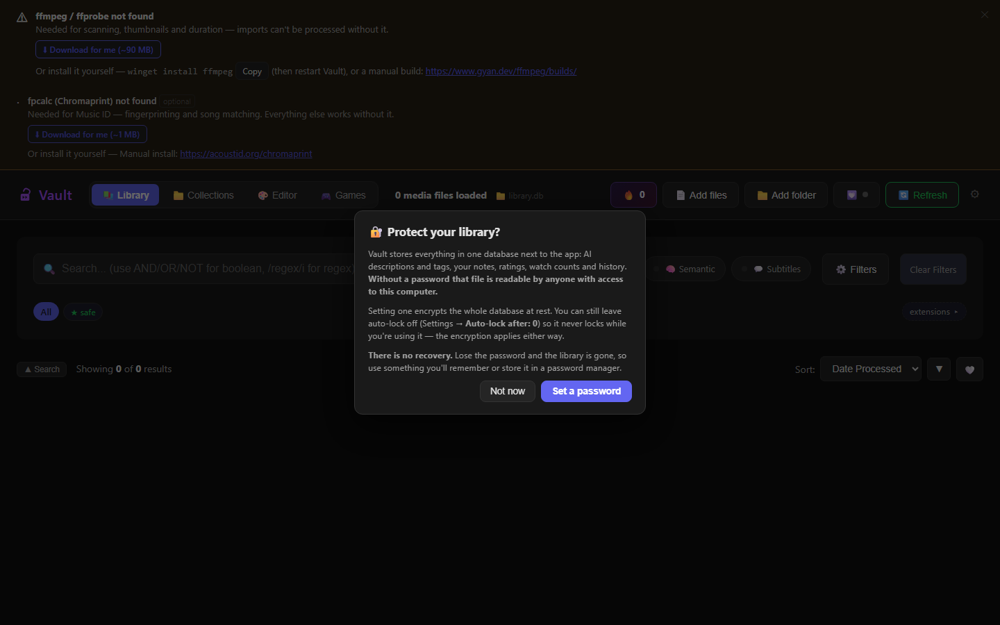
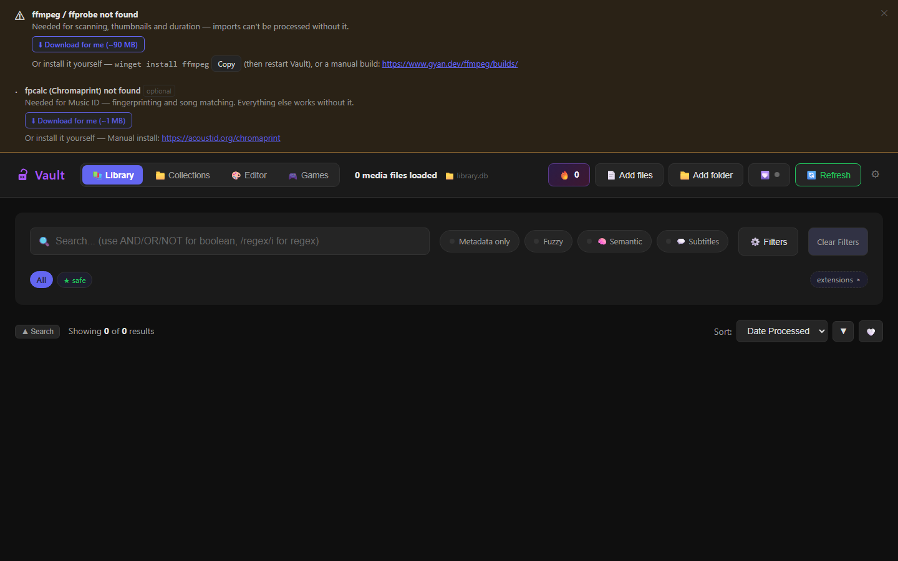
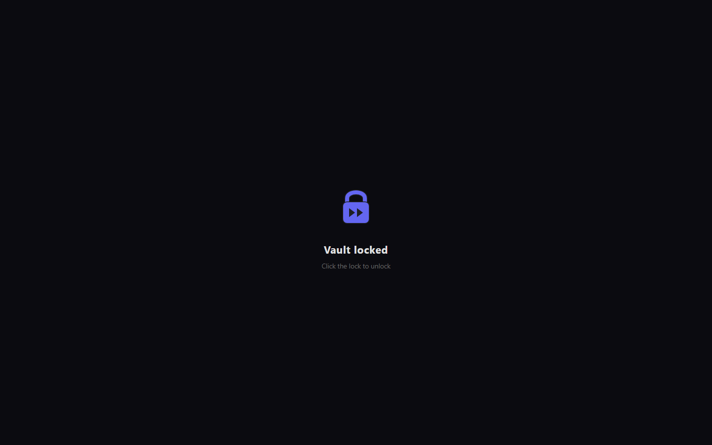

# Vault — Setup & Walkthrough

Everything runs on your machine. Nothing is sent anywhere except your own
local AI server (LM Studio or Ollama).

---

## 1. Quick start (5 minutes)

No installer, no dev tools, nothing to configure.

1. **Download `Vault-v*-win-x64.zip`** from the
   [Releases page](../../releases/latest).
2. **Unzip it anywhere** — it's portable. Everything Vault creates (database,
   thumbnails, trash, models) is written next to the exe, so the whole folder
   can be moved, copied, or backed up wholesale.
3. **Run `Vault.exe`.** The build is unsigned, so Windows SmartScreen warns the
   first time — that's expected: **More info → Run anyway**.
   <!-- TODO screenshot: the two SmartScreen dialogs (initial warn + "Run anyway"
        after More info). Must be taken on a real machine — can't be automated. -->
4. **A console window opens.** That's the server — leave it open; closing it
   stops Vault. The viewer opens in your browser at
   **http://127.0.0.1:8765**.
5. **First launch offers a password.** Optional — it encrypts the library
   database. There is **no recovery if you lose it**: nobody, including you,
   can unlock the database without it. Skip it and everything else works the
   same.

   

6. **If ffmpeg or fpcalc are missing**, the viewer shows a **⬇ Download**
   banner — one click fetches them next to `Vault.exe` and they work
   immediately, no PATH edits and no restart. (`winget install ffmpeg` works
   too if you'd rather install system-wide.)

   

7. **Add your media** with **📁 Add folder** / **📄 Add files**, or drag files
   onto the window. Files are referenced where they already are — Vault never
   copies or moves them.

That's a working library: browsing, playing, tagging and organizing all work
now. The steps below add the AI features.

### Optional tools (feature-by-feature)

| Tool | Needed for | Install |
|---|---|---|
| **ffmpeg + ffprobe** | thumbnails, duration probing, beat bar, subtitles, Music ID | **one click** — the ⬇ Download banner in the viewer (or `winget install ffmpeg`) |
| **LM Studio** *or* **Ollama** | AI scanning, semantic search, chat-based translation fallback | see §2 — step-by-step |
| **fpcalc** (Chromaprint) | Music ID fingerprinting | **one click** — same banner (or [acoustid.org/chromaprint](https://acoustid.org/chromaprint) → PATH) |
| **Python + faster-whisper** | transcription/subtitles | `pip install faster-whisper` — or into a venv, then set `PYTHON_PATH` to that interpreter (see below) |

The ⬇ banner puts the downloaded tools next to `Vault.exe` and they work
immediately — no PATH edits, no restart. It applies to the source checkout
too, where the tools land next to the repo.

**Subtitles are the exception.** They need a Python interpreter plus a pip
package, so there's no single file to drop next to the exe. Press **Generate**
without them and Vault explains exactly what's missing and how to install it.
Vault looks for `faster-whisper` in whichever Python `PYTHON_PATH` names, or
plain `python` from PATH if that's unset — so if you install into a **virtual
environment**, point `PYTHON_PATH` at `…\venv\Scripts\python.exe` or Vault won't
find it.

---

## 2. AI backend — LM Studio or Ollama

Vault talks to any **OpenAI-compatible** `/v1/chat/completions` server and
load-balances across several (multi-GPU). Scanning needs a **vision** model.

### Option A — LM Studio (default, zero config) — full walkthrough

<!-- TODO screenshots (must be taken in the LM Studio desktop app, can't be
     automated): 1) the download page showing Bionic ABOVE the classic
     "Download LM Studio" section; 2) Model Search with a vision model result;
     3) the Developer-tab load dialog with "manually choose load parameters" ON
     and Context Length set to ~60000; 4) the Developer tab showing
     Status: Running on port 1234. Drop them in images/setup/ and reference
     them at the matching steps below. -->

**1. Install LM Studio — the classic app, not Bionic.**
Download from **[lmstudio.ai/download](https://lmstudio.ai/download#lm-studio-download-heading)**.

> ⚠ The download page lists **"LM Studio Bionic"** (their new agent product)
> *above* the one you want. Scroll to the **"Download LM Studio"** section —
> the one described as *"Chat interface and programmable API"*. Bionic does
> not expose the local server Vault talks to.

Run the installer; on first launch you can skip the onboarding suggestions —
you'll pick your own model next.

**2. Download a vision model.**
1. Open **Model Search** in LM Studio's left sidebar.
2. Search for a model from that fits your VRAM:

| VRAM | Model |
|---|---|
| 6–8 GB | minicpm-v-4.6-abliterated-max  |
| 10–12 GB | qwen3.5-4b-uncensored-hauhaucs-aggressive@q4_k_m |
| 16 GB | qwen3.5-4b-uncensored-hauhaucs-aggressive@q8_0 |
| 24 GB+ | qwen3.5-9b-uncensored-hauhaucs-aggressive@q4_k_m |

4. Pick the appropriate model when offered then hit **Download** and wait for the download to finish.
   


**3. Load it — with a bigger context window.** This is the step everyone misses:
1. Open the **Developer** tab in the left sidebar and load the model from there.
2. Turn on the toggle for **manually choosing load parameters** — without it you
   get the defaults and no chance to change them.
3. Set **Context Length** to **~64000** tokens. The default (~4k) is far too
   small — every scan sends several frames plus the prompt, and a 4k context
   silently truncates them into empty or garbage metadata.
5. **Load the model.**


**4. Start the local server.**
1. Still in the **Developer** tab, make sure **Status** reads **Running**.
2. The port should be **1234** (LM Studio's default — leave it).
3. That's it. Vault's default endpoint is already
   `http://localhost:1234/v1/chat/completions`, and LM Studio serves whatever
   model is loaded — no model name, no API key, nothing to configure in Vault.
4. **Loaded more than one model?** (For example the embedding model for
   semantic search alongside the vision model.) LM Studio then needs to be
   told which one scans should use — Vault pauses the scan and shows a picker
   in the scan panel; choose your **vision** model and it resumes. The choice
   lasts until you close Vault; set `AI_MODEL` to make it permanent.
   

**5. Verify.** Back in Vault, drag a file in (or press ▶ Resume if a scan is
paused waiting for the model). The scan panel should start moving; the file's
description and tags appear when its scan lands.

### Option B — Ollama

Ollama **requires the model name in each request**, so set two env vars:

```bat
ollama pull qwen3.5vl:7b          &rem vision model for scanning (see §3)
ollama pull nomic-embed-text      &rem embeddings for semantic search

set LM_STUDIO_URLS=http://localhost:11434/v1/chat/completions
set AI_MODEL=qwen3.5vl:7b
set EMBEDDING_MODEL=nomic-embed-text
start.bat
```

(Or set them once in System → Environment Variables so start.bat always sees them.)

### Multi-GPU

Run one server instance per GPU and list both endpoints:

```
LM_STUDIO_URLS=http://localhost:1234/v1/chat/completions,http://localhost:1235/v1/chat/completions
```

---

## 3. Model recommendations by GPU size

Vision model = scan quality. Quantized (Q4) versions are the sweet spot.

| VRAM | Vision model (scanning) | Whisper (subtitles) | Notes |
|---|---|---|---|
| **6–8 GB** | minicpm-v-4.6-abliterated-max | `WHISPER_MODEL=small` | Lower `VISION_WORKERS=1`; scans are slower but fine |
| **10–12 GB** | qwen3.5-4b-uncensored-hauhaucs-aggressive@q4_k_m | `large-v3-turbo` @ `int8_float16` (default) | The defaults target this class |
| **16 GB** | qwen3.5-4b-uncensored-hauhaucs-aggressive@q8_0 + 2-4 workers | default | Room for `PIPELINE_DEPTH=3` |
| **24 GB+** | qwen3.5-9b-uncensored-hauhaucs-aggressive@q4_k_m + 2-4 workers | default | Multi-worker scanning shines: `VISION_WORKERS=2` |

- **Embeddings** (semantic search) are tiny — `nomic-embed-text` (~0.5 GB) runs anywhere.
- **Whisper** sizes: `small` ≈ 1 GB, `large-v3-turbo` int8 ≈ 1.5 GB VRAM; it
  shares the GPU with scans, jobs queue one at a time so they never collide.

---

## 4. Every advanced user-editable setting (defined ONCE, in `config/index.js`)
**Only modify if you know what you are doing.**

All settings live in `config/index.js` and read environment variables —
nothing is duplicated elsewhere (`start.bat` asks the config for the port).

The `VAULT_*` names are current — the former `VIDEO_TAGGER_*` names are still read
as a fallback, so an existing `.env` keeps working.

| Env var | Default | What it does |
|---|---|---|
| `MEDIA_TAGGER_PORT` | `8765` | Viewer port |
| `VAULT_DB` | `./vault.db` | Library database file |
| `VAULT_DB_PASSWORD` | — | Auto-unlock an encrypted Vault at boot |
| `LM_STUDIO_URLS` | `http://localhost:1234/v1/chat/completions` | AI endpoint(s), comma-separated |
| `AI_MODEL` | *(unset)* | Model name per request — **required for Ollama**, ignored by LM Studio |
| `EMBEDDING_MODEL` | `text-embedding-nomic-embed-text-v1.5` | Semantic-search embedding model |
| `PYTHON_PATH` | `python` (from PATH) | Which Python runs the transcription / translation / diarization sidecars — point it at `…\venv\Scripts\python.exe` if you installed `faster-whisper` into a virtual environment |
| `WHISPER_MODEL` | `large-v3-turbo` | Transcription model (`small` for low VRAM) |
| `WHISPER_IDLE_MINUTES` | `5` | `0` = once loaded, Whisper stays loaded; `N` = unload the sidecars after N idle minutes (low-VRAM boxes) |
| `WHISPER_VAD` | `1` | Voice-activity filter — only decode speech, skip music/silence (faster transcription on padded content). `0` to disable |
| `WHISPER_VAD_MIN_SILENCE_MS` | `500` | Minimum silence gap (ms) the VAD treats as a break — raise it if speech gets clipped |
| `SUB_ALLOW_DOWNLOADS` | *(ask per model)* | AI models (whisper + translation packs + speaker-diarization models) already on disk **always** load offline. This governs the one-time fetch of a model that isn't installed yet. Unset, Vault **asks before each individual model** and remembers each answer separately — approving the transcription model does not approve a Japanese translation pack later (Settings → *AI model downloads* lists every model it has needed). `1` = pre-approve everything, no prompts. `0` = never touch the network (missing model errors with instructions — air-gapped / strict mode). `VAULT_OFFLINE=1` forces this off, and the environment always beats the in-app switches |
| `VAULT_OFFLINE` | `0` (unset) | Hard offline switch: `1` = loopback-only networking app-wide (model downloads, update checks, remote AI endpoints all refuse; localhost services keep working). Implies `SUB_ALLOW_DOWNLOADS=0` and sets `HF_HUB_OFFLINE`/`TRANSFORMERS_OFFLINE` for the Python sidecars |
| `VAULT_AUTOLOCK_MINUTES` | `30` | Auto-lock idle timeout (0 = off) |
| `VAULT_TRASH` | `./trash` | Trash folder (opaque filenames) |
| `VAULT_THUMBS` | `./thumbnails` | Thumbnail/cache folder |
| `FRAME_WORKERS` / `VISION_WORKERS` / `PIPELINE_DEPTH` | `4` / `1` / `2` | Scan parallelism (see §3) |

---

## 5. Troubleshooting

| Symptom | Fix |
|---|---|
| Double-clicked `Vault.exe` and a window flashed open then vanished | Vault is probably already running — only one server per folder. Open http://127.0.0.1:8765 |
| Windows SmartScreen blocked the app | **More info → Run anyway**. The build is unsigned; the warning is expected |
| `Node.js is required but was not found` | Install Node LTS from nodejs.org, reopen the terminal (§6 — source checkout only) |
| `No LM Studio endpoints available` / scan errors instantly | Start LM Studio's server (or Ollama) and check `LM_STUDIO_URLS`; for Ollama also set `AI_MODEL` |
| Scans produce empty/garbage metadata | The loaded model isn't a **vision** model (load one from §3), or its **context length is at the ~4k default** — reload it at ~64k (§2, step 3) |
| `database is encrypted — password required` at boot | The Vault is locked: open the viewer and click the padlock, or set `VAULT_DB_PASSWORD` |
| Thumbnails/duration missing on imports | ffmpeg missing — use the ⬇ banner in the viewer, or install to PATH |
| Music ID says tools missing | fpcalc missing — same ⬇ banner |
| Subtitles fail to generate | Press ▶ Generate — Vault says exactly what's missing. Usually `pip install faster-whisper`; if you used a venv, set `PYTHON_PATH` to its interpreter |
| Diarization/subtitles report that downloads are off | Either pre-install the models (`whisper` / OPUS-MT / `models/diarize` dirs) or set `SUB_ALLOW_DOWNLOADS=1` (and ensure `VAULT_OFFLINE` is unset) |

The lock screen, for reference — one click on the padlock reveals the password
box:



---

## 6. Run from source (CLI)

For developers, or anyone who'd rather run the Node app directly than the
packaged exe. **These files are in the repository, not in the release zip** —
clone or download the repo first; the zip contains only `Vault.exe` and its
runtime.

1. **Install [Node.js](https://nodejs.org)** (LTS).
2. In the repo folder, run **`npm install`** once.
3. Double-click **`start.bat`** — it starts the local server and opens the
   viewer in your browser (same UI, same `http://127.0.0.1:8765`).
4. **Drag media files onto the window** to add them (playable immediately),
   or run **`scan.bat`** for the interactive wizard that indexes whole folders:
   pick a directory (it remembers your history), toggle options with the arrow
   keys, go. It prints the equivalent flag command before each run.

Flag-style usage works everywhere:

```bash
node vault.js scan /path/to/media --recursive --all-types
node vault.js serve            # same as start.bat
node vault.js status           # library stats
```

Everything in §2–§5 applies unchanged — the source checkout and the exe read
the same environment variables and talk to the same AI backends. The only
difference is where app data lands: next to the repo instead of next to
`Vault.exe`.
